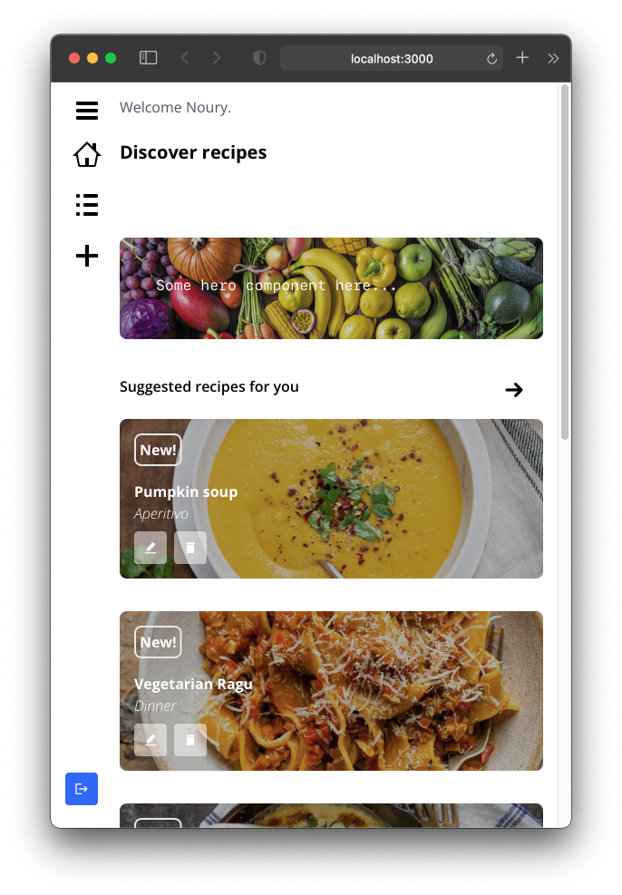
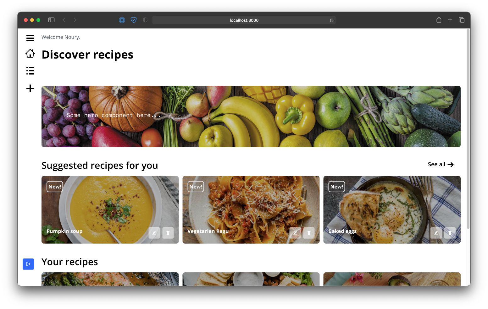
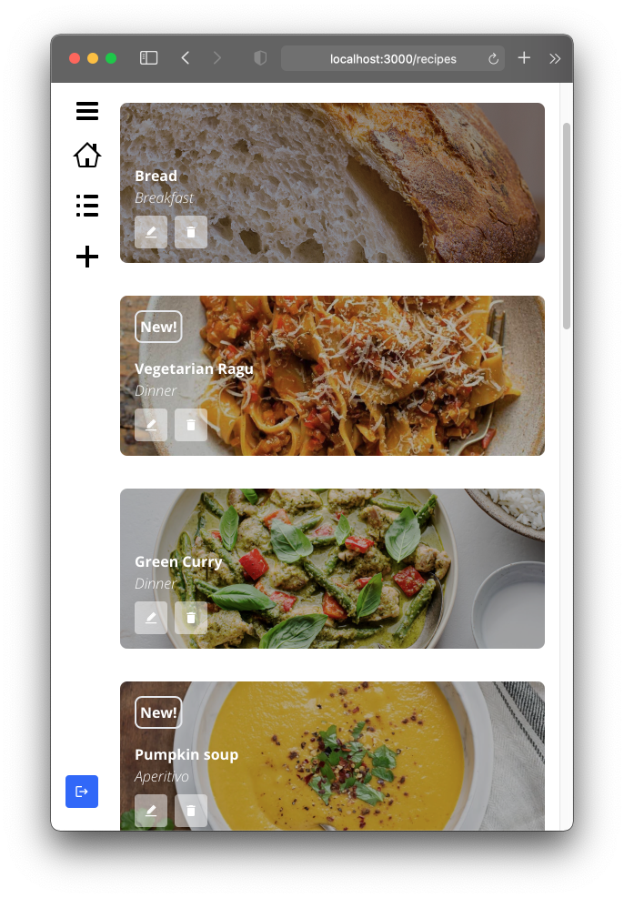
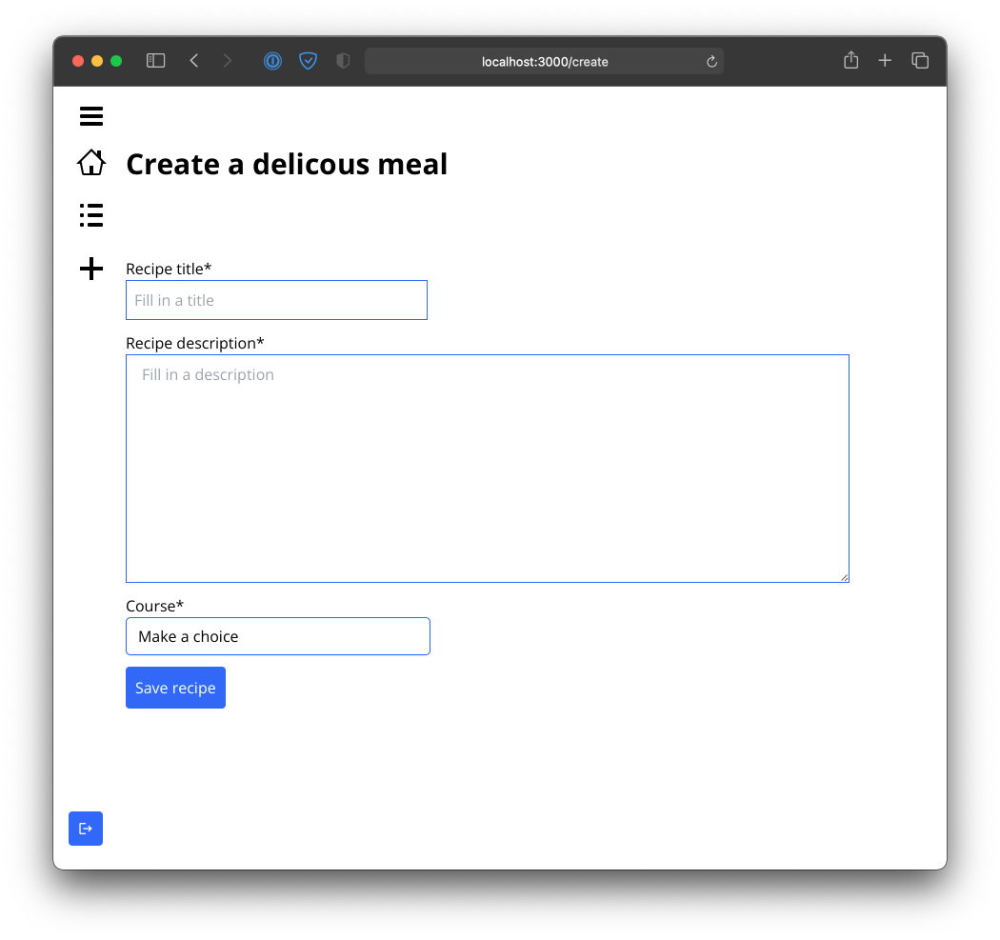

# Recipes

## About

Welcome to my recipe app 🥗! Thank you for taking the time to read this document 🙏!
An app that generates groceries shopping lists from recipes. Recipes that you can create yourself or pick from the database of inspiring recipes by others. Note that this app is a work in progress and that its purpose is mostly to demonstrate my experience, current skillset at last but not least: interests as an engineer 🧑‍💻. Please refer to some screenshots below.

## Creator application

Roadmap features

- an account environment
- creator feature for new and managing recipes
- managing ingredients

_This application is currently being developed._

## Consumer application

Roadmap features

- a recipes overview list
- a recipes detail page which shows how to cook using the recipe
- a shopping list feature that allows users to generate shopping lists for doing groceries

## Work management

**[🗓 Backlog of current work can be found here](https://github.com/NouryJanse/recipes/projects/1)**

**[🗓 Roadmap of future features can be found here](https://github.com/NouryJanse/recipes/projects/3)**

## Architecture plan

A creator single page web app

- React
- Redux with Redux Toolkit
- React Router
- Styled Components
- Tailwind styling
- Axios
- Jest x React Testing Library UI and Unit tests (such as data transformations or functionality)

A data platform that allows multichannel access

- Fastify back-end
- Prisma
- Server side communication from REST to GraphQL
- Jest Unit and Integration test

A consumer high performance website

- Next consumer
- Static Render / ISR

## Back-End Justifications

#### SQL

- PostgreSQL: SQL is best for relationships between entities, postgresql is known for it's enterprise reliability and vast featureset

#### ORM's

- Prisma: big investors, serious continuous development, nice abstraction over SQL layer
- Other considered options: Sequelize, TypeORM, Mongoose

#### Frameworks

- Fastify: very high performance routing
- Considered: Nestjs, AdonisJS, Express, Meteor, Koa, Hapi

#### Logging

To be implemented in the future:

- Datadog
- Sentry
- Logrocket

### Moving to GraphQL (Plan for the future)

- Relay
- Apollo

## Storybook

Storybook is a work in progress

## Swagger docs on the API

Swagger documentation can be found by navigating to /docs

## Additional notes

- 🚨 Storybook is broken because of [incompatibility with React v18](https://github.com/storybookjs/storybook/issues/17831)
  > Construction on the Storybook therefore on hold
- 🚨 Currently testing is under construction, plans are to test the BE extensively through:

  > integration testing (on the routing and underlying functionality)

  > unit testing the Prisma models and expected behaviours

